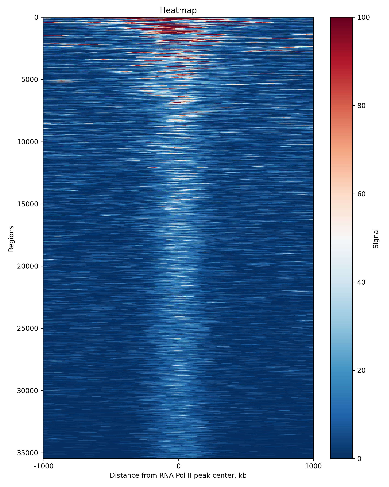

# Open Chromatin Peak Enrichment Analysis
BMI-8540 course project by Eglė Šidlauskaitė, PhD student at UNMC IGPBS BISB

University of Nebraska Omaha, Spring semester, 2025

# Abstract and Purpose
My project analyses two samples1 of mouse embryonic stem cells, one of which has undergone an 8 hour Flavopiridol (RNA Polymerase II inhibitor) treatment. The CUTAC-seq2 experiment is targeting RNA Pol II Serine 5 Phosphorylation in these samples which is a marker of transcription initiation and pausing. The project uses this data to visualize open chromatin peak enrichment by generating a heatmap for each sample. **My research question is: how does RNA Pol II inhibition affect chromatin accessibility surrounding RNA Pol II S5P?**

 

_Figure 1. Heatmap on the left side shows enrichment of open chromatin around RNA Pol II S5P before treatment. Heatmap on the right side shows enrichment of open chromatin around RNA Pol II S5P after 8 hours of RNA Pol II inhibitor treatment._

In the generated heatmaps (Figure 1) we can see a pretty consistent chromatin accessibility pattern, with about 10% of the peaks showing higher intensity. Once the sample is treated with the RNA Pol II inhibitor, the pattern of accessibility over the same peaks changes. In the second heatmap, three main sections of the plot can be identified:
- Almost 50% of the regions show no or very weak and dispersed signal. This pattern can imply that RNA Pol II S5P is not binding in these regions after treatment, therefore no DNA is fragmented. Furthermore, with RNA Pol II inhibited, these areas could be closing up and losing accessibility to them.
- About 35% of the regions show signals of similar strength as before, but with increased noise and dispersion. This would imply that RNA Pol II S5P is still bound to these regions but has moved slightly or chromatin accessibility surrounding it has changed.
- About 15% of the regions show higher signal which is a slightly higher part then before treatment. In these areas RNA Pol II S5P is not only still binding but chromatin is getting more accessible as well.

It is important to note that the regions of the heatmap in this case are sorted based on the average signal over the whole region. Therefore, we cannot state that the areas that show higher RNA Pol II S5P related chromatin accessibility after treatment are the same areas that showed higher accessibility before treatment.

In conclusion, from this short analysis we can see that RNA Pol II inhibition definitely affects RNA Pol II S5P associated chromatin accessibility. Further experiments and data analysis need to be done to find out the reasons for these changes. For example: 
- plotting of ATAC-seq signal over the same regions after treatment would show if the reduction of signal is observed because RNA Pol II S5P is not binding to these areas anymore or because the chromatin is getting compacted;
- sorting the regions in the second plot based on average intensity observed before treatment would let us quantify the change better, e.g. do regions with high signal maintain it after treatment?
- clustering the regions based on the signal and looking for relationships between the regions based on sequence annotation.


# Background
Chromatin is formed by tightly wrapping the DNA around nucleosomes which causes these parts of the sequence to be transcriptionally inactive. To obtain information about open chromatin, ATAC-seq3 method is used - DNA is fragmented using Tn5 transposase which cuts up accessible parts of the DNA and inserts sequencing adapters. Therefore, after sequencing, regions of open chromatin regions result in small DNA fragments. CUTAC-seq is a similar method that fragments open chromatin surrounding a specific protein target, e.g. RNA Polymerase II, a transcription factor of interest, etc. Using open chromatin peak enrichment analysis we can analyse transcriptional events, identify transcriptionally active regions and observe change in chromatin accessibility over different treatments.

The project uses CUTAC-seq data to visualize open chromatin peak enrichment in the form of a heatmap. The mechanism behind gene expression related to chromatin accessibility is not yet clear, therefore analysing how chromatin accessibility changes over different conditions is a relevant trend in research. An automated pipeline that allows to visualize and compare DNA accessibility in specific regions is useful to studying this question.

Although there are tools readily available to generate these heatmaps (such as the deeptools package), they are usually stand alone tools. This pipeline allows users to automatically download and process multiple files by simply entering their SRR IDs in relevant scripts. Furthermore, using Python offers users more flexibility for customizing the heatmap by directly editing the code, which enables adjustments beyond what existing tools allow. Finally, I believe that having a database that stores information about each processed sample and the generated visual could be a good long-term solution to keep data tidy when working with a lot of datasets.

# Objectives and outcomes
1) Using bash, download CUTAC-seq data and **pre-process** it for further analysis (trim adapters, map to a reference genome, read-length normalise samples, convert to bigWig format to store signal strength). Finally, generate a signal strength matrix (showing signal intensity over small intervals of selected regions of interest) that can be used for heatmap plotting.

2) Using Python, **plot** a heatmap for each sample showing chromatin accessibility in that sample.

3) Using bash, generate an SQL script that can be used to create a new database and **store information** about analysis of each sample in it.

# Project Components
Reproducible bash shell scripts:

- /bin/pre-process-data.sh
- /bin/call-peaks.sh
- /bin/compute-matrix.sh
- /bin/generate-plots.sh
- /bin/generate-sql-table.sh
- /bin/print-sql-line.sh

A Python script for data analysis or visualization:
- /bin/plot-heatmaps.py

A working database implementation:
- /outputs/store_sample_info.sql (generated by generate-sql-table.sh)

# Run information
The scripts are written to be used in Holland Computing Center (HCC), Swan server and are run using Slurm Workload Manager. 

Software requirements:
- bedtools (v2.27)
- R (v4.3)
- deeptools (v3.5)
- bowtie (v2.4)
- cutadapt (v2.9)
- samtools (v1.20)
- SRA toolkit (v2.11)
- UCSC utilities (bedGraphToBigWig) (v455)

Python package requirements:
- numpy (v1.22.4)
- matplotlib (v3.5.3)

Software package mounted to the GitHub repository:
- SEACR (v1.3)

The code can be easily adapted to run on a system without a workload manager and directly pre-installed software. It is enough to ensure that required software is in $PATH and to remove “module load” statements. Also, in such cases, Mus Musculus genome should be built and provided locally.

Using Slurm Workload Manager in HCC Swan server run:

```git clone https://github.com/eglsdl/BMI8540-project.git
cd BMI8540-project
sbatch ./bin/pre-process-data.sh
sbatch ./bin/call-peaks.sh
sbatch ./bin/compute-matrix.sh
sbatch ./bin/generate-plots.sh
sbatch ./bin/generate-sql-table.sh
```
Note: ensure to wait until one job is over before running the next one. The first job (/bin/pre-process-data.sh) can take up to an hour to finish.

To add the generated SQL table to your database using MySQL, run:

```cd outputs
mysql [DATABASE_NAME] < store_sample_info.sql
mysql
USE [DATABASE_NAME];
SHOW TABLES;
DESCRIBE my_heatmap_records;
```
# Script Functionality
Function of each script is documented in great detail in the script comments. Bellow is a short description of the function of each script used in the project:

- **/bin/pre-process-data.sh** - this script is used to download data of interest, trim adapters, map it to Mus Musculus (mm10) genome, convert mapping results to bed file format, read depth normalise samples and obtain bedGraph and bigWig files that show signal strength.
- **/bin/call-peaks.sh** - calls peaks of highest accessibility in a chosen sample (from bigWig input file) to produce a bed file. This file is later used for regions of interest, to plot chromatin accessibility in different samples over. 
- **/bin/compute-matrix.sh** - uses a bed file with regions of interest and sample signal intensity bigWig files to generate a signal intensity matrix for each sample. These matrices are later used for heatmap plotting.
- **/bin/plot-heatmaps.py** - reads a signal intensity matrix file (generated with deeptools) and plots a centered heatmap (also known as a  tornado plot).
- **/bin/generate-plots.sh** - runs /bin/plot-heatmaps.py script for each sample.
- **/bin/print-sql-line.sh** - writes information about samples processed in this pipeline in a SQL format so that the information could be easily added to a database.
- **/bin/generate-sql-table.sh** - runs /bin/print-sql-line.sh script for each sample.
- **/outputs/store_sample_info.sql** - stores generated SQL commands that can be used to create a new database table and populate it with experiment information.

# License
Project is stored under a MIT License.

# Data Provenance
Project uses FASTQ data from a CUTAC-seq experiment targeting RNA Polymerase II Serine 5 Phosphorylation on mouse embryonic stem cells. No data usage restrictions were found. Samples and their IDs:
- SRR23310242 (GSM7019045) - no treatment.
- SRR23310241 (GSM7019046) - 8 hour Flavopiridol (RNA Pol II inhibitor) treatment.

# Users
Overall, the project provides enough background and instructions to be easily understood by any user with basic skills in bash and linux terminal. In order to successfully run the code without major adjustments, users need access to the HCC Swan server. The users that would potentially use this project are:
- Students / young researchers who are new in the bioinformatics field and want to learn how to run a basic genomics data processing pipeline. 
- Students / young researchers who are interested in being able to customize the accessible chromatin heatmap in more detail.
- Students / young researchers who are looking for alternative ways of keeping a log of their data analysis results.

# Implementation constraints
- The Odin server had a quite strict memory limitation, however I was able to move my project to the HCC Swan server.
- I do not have access to a MySQL database on the HCC Swan server. Therefore, I was unable to implement the database requirement by accessing the database directly from a Python script, which would have been a more useful skill for me to work on.
- I wanted to try the approach of plotting the heatmap using the matplotlib library in Python (instead of the usual deeptools plotHeatmap approach) because I believe this could give more flexibility in adjusting the look of the heatmap. However, I underestimated how long this project would take me to complete all together, therefore I ran out of time to actually customize the plots more.

# Privacy
The database and my project itself are not subject to any privacy requirements as it does not contain any private or personal data. All data used in the project is freely available online.

# Originality
In my honor as a student of the University of Nebraska at Omaha, I have neither given nor received unauthorized help on this assignment.

# References 
1.	Brahma, S. & Henikoff, S. The BAF chromatin remodeler synergizes with RNA polymerase II and transcription factors to evict nucleosomes. Nat. Genet. 56, 100–111 (2024).
2.	Henikoff, S., Henikoff, J. G., Kaya-Okur, H. S. & Ahmad, K. Efficient chromatin accessibility mapping in situ by nucleosome-tethered tagmentation. eLife 9, e63274.
3.	Grandi, F. C., Modi, H., Kampman, L. & Corces, M. R. Chromatin accessibility profiling by ATAC-seq. Nat. Protoc. 17, 1518–1552 (2022).
4.	Ramírez, F. et al. deepTools2: a next generation web server for deep-sequencing data analysis. Nucleic Acids Res. 44, W160–W165 (2016).
5.	Jette, M. A. & Wickberg, T. Architecture of the Slurm Workload Manager. in Job Scheduling Strategies for Parallel Processing: 26th Workshop, JSSPP 2023, St. Petersburg, FL, USA, May 19, 2023, Revised Selected Papers 3–23 (Springer-Verlag, Berlin, Heidelberg, 2023). doi:10.1007/978-3-031-43943-8_1.
6.	Quinlan, A. R. & Hall, I. M. BEDTools: a flexible suite of utilities for comparing genomic features. Bioinformatics 26, 841–842 (2010).
7.	R: The R Project for Statistical Computing. https://www.r-project.org/.
8.	Langmead, B. & Salzberg, S. L. Fast gapped-read alignment with Bowtie 2. Nat. Methods 9, 357–359 (2012).
9.	Martin, M. Cutadapt removes adapter sequences from high-throughput sequencing reads. EMBnet.journal 17, 10–12 (2011).
10.	Li, H. et al. The Sequence Alignment/Map format and SAMtools. Bioinformatics 25, 2078–2079 (2009).
11.	SRA Toolkit Development Team. NCBI SRA Toolkit. GitHub https://github.com/ncbi/sra-tools/wiki/01.-Downloading-SRA-Toolkit.
12.	Kent, W. J. et al. The Human Genome Browser at UCSC. Genome Res. 12, 996–1006 (2002).
13.	Harris, C. R. et al. Array programming with NumPy. Nature 585, 357–362 (2020).
14.	Hunter, J. D. Matplotlib: A 2D Graphics Environment. Comput. Sci. Eng. 9, 90–95 (2007).
15.	Meers, M. P., Tenenbaum, D. & Henikoff, S. Peak calling by Sparse Enrichment Analysis for CUT&RUN chromatin profiling. Epigenetics Chromatin 12, 42 (2019).
